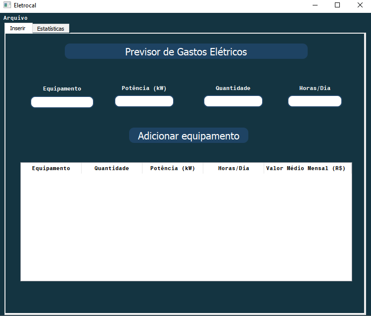
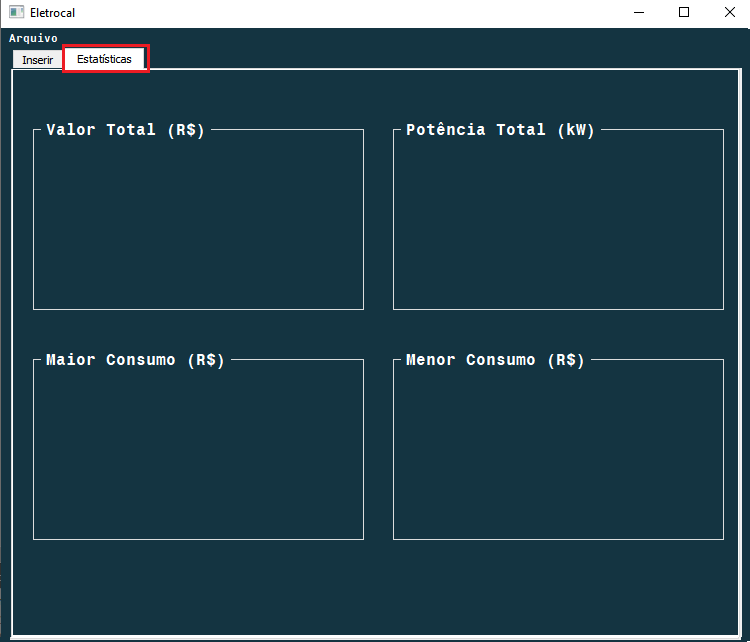
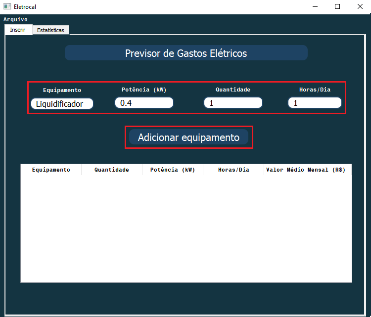
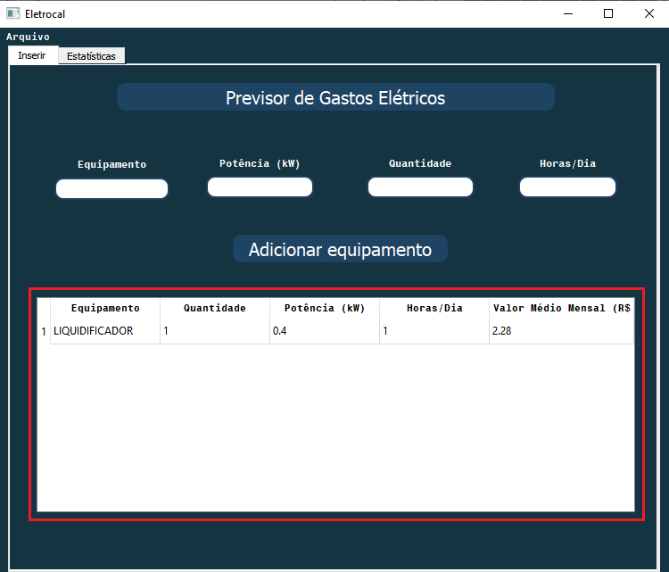
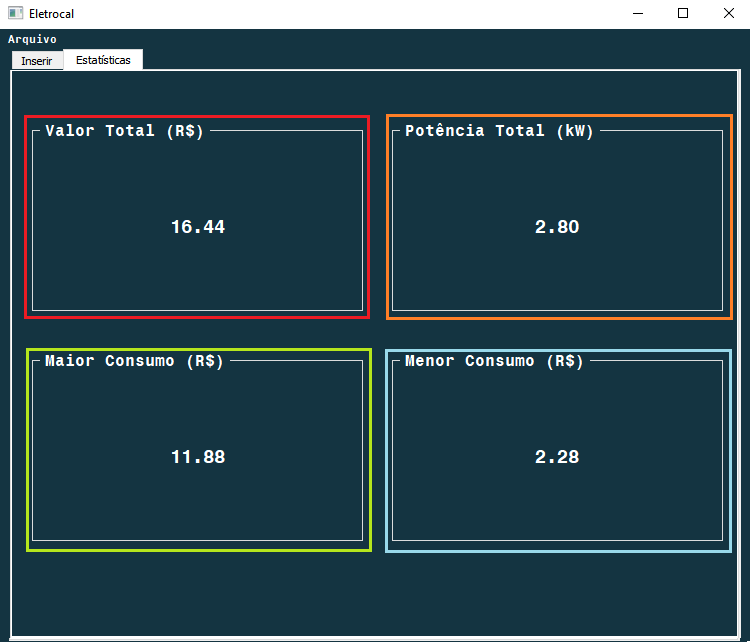
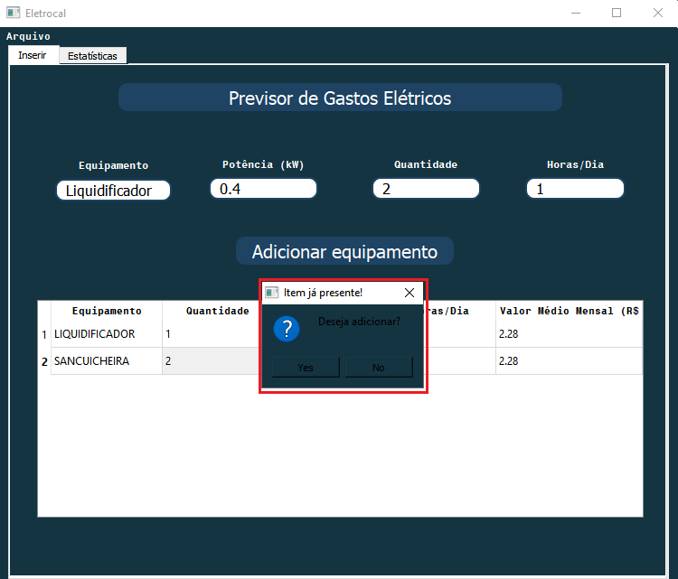
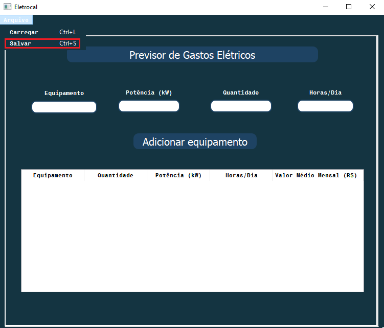
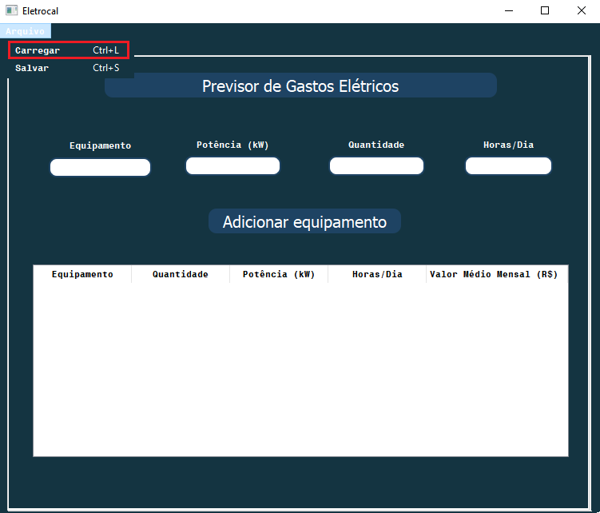

# Eletrocal
### Projeto executado para a Disciplina de Técnicas de Programação 2018.2. Aplicativo capaz de prevêr o gasto de energia elétrica residencial ou comercial mensal a partir da inserção dos aparelhos elétricos utilizados.

O Eletrocal permite ao usuário compreender o valor do pagamento mensal de energia elétrica de sua residência ou comércio, a potência total utilizada no mês, o maior valor gasto dos aparelhos e o menor valor gasto entre os aparelhos.

Também, o aplicativo possui além da tela principal usada para o inserir os aparelhos elétricos, uma aba para observar as estatísticas e conhecer os gastos simultaneamente.

# Manual do Usuário

### Eletrocal foi feito para qualquer pessoa utilizá-lo, por isso foi pensado para ser de fácil utilização e visualização dos dados. Com isso você pode ter prontamente o gasto elétrico mensal de sua residência ou comércio, uma vez que, ajudará a equilibrar todo o gasto elétrico.

# Primeiros Passos

Como o app foi desenvolvido para qualquer pessoa utilizar, na sua tela padrão inicial está todos os dados solicitados para que possa ser calculado os gastos. Basta apenas colocar o nome do equipamento, a quantidade, a potência do aparelho em kW e as horas/dia usadas. Pronto, com isso você apenas clica no botão "Adicionar Equipamento" o qual já irá para a tabela.

Pronto com os dados já setados, é necessário apenas clicar no botão para adicionar. O item será adicionado na tabela já com seu valor de gasto mensal calculado, além disso...

Na aba de estatísticas você observará o valor total calculado dos itens inseridos(vermelho), a potência total dos equipamentos adicionados(laranja), o maior gasto por aparelho(s)(verde), além do menor gasto(azul).

Tudo certo né? Caso você queira adicionar equipamentos com o mesmo nome, basta inserir seus dados e a quantidade a ser adicionada. Após clicar no botão de adicionar, uma mensagem aparecerá perguntando se deseja adicionar, para isso basta apenas selecionar o "Yes".

Legal! Agora você já pode utilizar o Eletrocal sozinho!! Viu que a interface é atrativa e facilmente utilizável? Pois é, foi ligeiramente pensado para atender a sua necessidade.

### Salvando e carregando arquivos

Para que todos os seus dados não sejam jogados fora ao terminar de utilizar o Eletrocal, criamos a opção de Salvar e Carregar arquivos, os quais são em formato texto(.txt) ou separados por vígurla(.csv), veja como isto ficou tão simples.Salvando em 3,2,1...

Carregando em 3,2,1...

Agora você está completamente apto para usar o aplicativo.

### Menos gastos e mais prevenção! Bom uso do Eletrocal!

